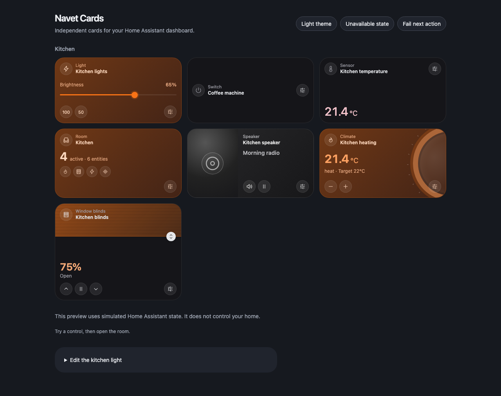

# Navet Cards

**Everyday home controls, right in your Home Assistant dashboard.**

[](https://github.com/navet-app/navet-cards/actions/workflows/ci.yml)
[](LICENSE)

Turn on the kitchen lights, check the temperature, adjust the heating, or pause the music from compact cards with warm state accents. Add them to the Home Assistant dashboard you already use and configure each card through the visual editor or YAML.

Navet Cards includes **light, switch, sensor, room, media, climate, cover, fan, lock, vacuum, person, weather, number, select, and navigation** cards, plus grouped readings, notes, photos and actions. Choose compact, comfortable, or row layouts and automatic, light, dark, black, or glass themes. Controls follow each entity's supported capabilities.



*Preview with simulated devices. Home Assistant owns your dashboard layout and device state.*

[Install the beta](#install-the-beta) · [Configure a card](#configuration) · [Ask for help](https://github.com/navet-app/navet-cards/discussions) · [Report a bug](https://github.com/navet-app/navet-cards/issues/new/choose)

## Before you install

Navet Cards is an early beta for **Home Assistant 2024.6.4 or newer**. It runs inside Home Assistant's dashboard (also called Lovelace), using your existing login and device connections. Build it with Node.js 22 or newer; Node.js is only needed on the computer building the resource.

This collection is a companion to [Navet](https://github.com/navet-app/navet), the standalone smart-home dashboard. You can use Navet Cards independently in Home Assistant. Room dialogs provide direct device controls and access to Home Assistant's entity details, where advanced controls such as light color are available. Controls follow each device's advertised capabilities.

Automated checks cover a simulated browser host and isolated Home Assistant 2024.6.4 and 2026.9.4 instances with demo entities. Household devices, companion apps, and HACS installation still need acceptance testing. Read the [verification status](docs/verification-status.md) for the evidence and remaining checks.

## Try the cards

Use Node.js 22 or newer:

```sh
npm ci
npm run build
npm run dev
```

Open [the local preview](http://127.0.0.1:4178/demo/) or the [composition preview](http://127.0.0.1:4178/demo/composition.html). The preview uses simulated devices, with theme switching, unavailable states, command failures, and a working card editor.

## Review cards in a pull request

Use the Cloudflare Pages preview link on the PR to open the card catalog or room composition. Compare the changed cards with [Navet's live demo](https://demo.navet.app/) at the same viewport size. Check small and extra-small examples, all four themes, unavailable states, action failures, and keyboard controls. The preview uses simulated devices.

### Connect PR preview hosting

Connect `navet-app/navet-cards` to a Cloudflare Pages project with these settings:

- Production branch: `main`.
- Framework preset: None.
- Build command: `npm ci && npm run build:preview`.
- Build output directory: `dist/preview`.
- Environment variable: `NODE_VERSION=22`.
- Preview branch deployments: all branches, with PR comments enabled.

Cloudflare's Git integration supplies the preview URL on the PR. It builds the public simulated catalog without Home Assistant credentials.

### Download a preview from CI

GitHub Actions also saves an interactive preview independently of hosting. Open the PR's **Validate cards** check and its run summary, then download **navet-cards-preview** from the current PR head after its checks pass. Extract it and run this command inside the extracted folder:

```sh
python3 -m http.server 4178
```

Open `http://localhost:4178` and choose the card catalog or room composition. The **navet-cards-verification** artifact contains the built resource, verification bundle, and browser screenshots.

## Install the beta

1. Obtain `navet-cards.js` from a tested release or verification bundle. To build the resource from source:

   ```sh
   git clone https://github.com/navet-app/navet-cards.git
   cd navet-cards
   npm ci
   npm run build
   ```

2. Copy `dist/navet-cards.js` into your Home Assistant `/config/www/` directory. If you create the `www` directory for the first time, restart Home Assistant.
3. Open your dashboard, choose **Edit dashboard**, open its menu, and select **Manage resources**. Enable Advanced mode in your Home Assistant profile if the resource menu is hidden.
4. Add `/local/navet-cards.js?v=0.1.0-beta.3` as a **JavaScript Module** resource. Update an existing Navet resource rather than registering a second copy.
5. Refresh the dashboard. Choose **Add card** and search for **Navet**.
6. Select a supported entity and configure the card in the visual editor or YAML.

For a YAML-managed resource list:

```yaml
resources:
  - url: /local/navet-cards.js?v=0.1.0-beta.3
    type: module
```

When replacing the resource, change the version in its URL and reload each browser or companion-app frontend. Keep a copy of the previous resource to roll back. Existing dashboard card configurations stay in Home Assistant.

Run `npm run package:verification` to produce a verification folder and ZIP under `dist/`, including the resource, checksum, instructions, and test status.

### HACS distribution

Use the manual installation above for this beta. HACS needs a downloadable `navet-cards.js` in the repository or a GitHub release; this repository builds the file locally and has no published release asset yet.

The [HACS Dashboard manifest](hacs.json) and [release workflow](docs/release-workflow.md) are included. When a tested release asset is available, add `https://github.com/navet-app/navet-cards` through HACS **Custom repositories**, with type **Dashboard**. Follow the [HACS custom-repository guide](https://www.hacs.xyz/docs/faq/custom_repositories/). Clean installation and upgrade must be verified before recommending this route. Default HACS catalog inclusion is a separate submission.

## Configuration

| Card type | Supported selection | Controls |
| --- | --- | --- |
| `custom:navet-light-card` | `light.*` | On/off, brightness presets, and color temperature when supported |
| `custom:navet-switch-card` | `switch.*`, `input_boolean.*` | On/off |
| `custom:navet-sensor-card` | `sensor.*`, `binary_sensor.*` | Value, unit, optional attribute |
| `custom:navet-room-card` | HA area ID or explicit entities | Room status, lazy direct controls, and entity details |
| `custom:navet-media-card` | `media_player.*` | Playback, volume, skip, mute, and source selection when supported |
| `custom:navet-climate-card` | `climate.*` | Current temperature, target temperature orb, steps, and heating mode when supported |
| `custom:navet-cover-card` | `cover.*` | Open/stop/close and position when supported |
| `custom:navet-number-card` | `number.*`, `input_number.*` | Value slider with native limits, step and unit |
| `custom:navet-select-card` | `select.*`, `input_select.*` | Advertised options |
| `custom:navet-navigation-card` | Local paths or room hashes | Named navigation buttons |
| `custom:navet-fan-card` | `fan.*` | Supported on/off and speed percentage with presets |
| `custom:navet-lock-card` | `lock.*` | State and slide to lock/unlock; code-protected locks use entity details |
| `custom:navet-vacuum-card` | `vacuum.*` | Supported start, pause and return to dock; battery when provided |
| `custom:navet-person-card` | `person.*`, `device_tracker.*` | Presence and entity picture |
| `custom:navet-weather-card` | `weather.*` | Condition, prominent temperature, feels-like reading and daily forecast when supplied |
| `custom:navet-scene-card` | `scene.*` | Run scene |
| `custom:navet-script-card` | `script.*` | Run script |
| `custom:navet-entity-card` | Any entity | State, unit, supported toggle, and entity details |
| `custom:navet-info-card` | `entities` list of sensors | Live grouped readings and entity details |
| `custom:navet-battery-card` | `entities` list of sensors | Battery readings, percentage bars and low-battery highlighting |
| `custom:navet-ups-card` | `entities` list of sensors | Selected UPS status and metrics |
| `custom:navet-energy-now-card` | `entities` list of sensors | Power/energy readings and a 24-hour power history chart |
| `custom:navet-media-stack-card` | `entities` list of media players | Selected-player speaker controls and entity details |
| `custom:navet-note-card` | `input_text.*`, `text.*`, or `content` | Save notes to a text helper or display configured text |
| `custom:navet-photo-card` | `image.*` or `image` URL | Single photo or gallery with an image description |
| `custom:navet-button-card` | Button, scene, script, or `tap_action` | Run an entity action, service, or local navigation |

### Custom cards

Custom cards appear in Home Assistant's card picker alongside the entity cards. Use `entities` for grouped readings (1–24 IDs). Put the power sensor first in Energy Now and the daily energy sensor second. Values retain their sensor units. Its chart reads the power sensor’s previous 24 hours from Home Assistant history; if history is unavailable, the card says so. Weather requests the daily forecast when the weather entity supports it. These requests use the injected Home Assistant host and refresh on state updates at most once every five minutes.

Choose UPS status, battery, load and runtime sensors explicitly to match your device. Battery sensors are recognized by device class or their battery/charge name; other selected measurements appear in compact tiles. Media Stack shows one selected player using the speaker card controls. Choose another player from its selector.

```yaml
type: custom:navet-info-card
name: Kitchen readings
entities:
  - sensor.kitchen_temperature
  - sensor.kitchen_humidity
```

To edit a note from the dashboard, create a Text helper in Home Assistant and select it:

```yaml
type: custom:navet-note-card
entity: input_text.kitchen_note
```

Select the note text to open its editor. Save writes to the helper using its native length limits; Escape closes the editor without saving. A failed save keeps your draft so you can retry. Password helpers stay private and are opened through entity details. For text configured in the dashboard, use `content: Remember to water the plants` without an entity.

```yaml
type: custom:navet-photo-card
name: Mountains
image: /local/mountains.jpg
alt: Mountain lake at sunrise
```

For a gallery, use `images` with 1–24 URLs. Arrow buttons and dots select the displayed photo. Shuffle chooses another image at random when you use an arrow. The `alt` text describes the displayed image.

Photo sources can be local paths or HTTP(S) URLs; an `image.*` entity supplies its entity picture. Unavailable images display a fallback. A Home Assistant image uses the host's own picture URL. External image servers must allow your browser to load the image.

```yaml
type: custom:navet-button-card
name: Evening routine
tap_action:
  action: perform-action
  perform_action: scene.turn_on
  target:
    entity_id: scene.evening
```

The current custom catalog includes Info, Note, Photo, Action, Battery, UPS, Energy Now, and Media Stack. RSS, Map, and Assist are planned separately. Weather displays current conditions and supported daily forecasts; Media Stack controls the selected player.


```yaml
type: custom:navet-light-card
entity: light.kitchen
name: Kitchen lights
layout: compact
show_brightness: true
appearance:
  accent: "#ea8c55"
  radius: 24
  theme: auto
tap_action:
  action: toggle
hold_action:
  action: more-info
grid_options:
  columns: 6
  rows: 3
```

Common fields:

| Field | Meaning | Default |
| --- | --- | --- |
| `entity` | Supported Home Assistant entity ID | Required on entity cards |
| `name` | Card title | Entity friendly name or area name |
| `icon` | Icon such as `mdi:lightbulb-outline` | A relevant icon for the card |
| `size` | `small` or `extra-small` | Switch footprint; defaults to `small` |
| `layout` | `compact`, `comfortable`, or `row` | `compact` |
| `show_state` | Show state or sensor value | `true` |
| `show_brightness` | Show supported brightness control | `true` on light cards |
| `appearance.accent` | Six-digit hex color | Theme variable, Navet orange, or the card family accent |
| `appearance.radius` | Corner radius, 0–48 pixels | 24 pixels |
| `appearance.preset` | `warm`, `neutral`, or `cool`; accent can override it | `warm` |
| `appearance.effects` | `low` uses opaque glass and simpler decoration; `high` enables glass blur | `low` |
| `panel_id` | Unique room hash such as `#kitchen` | Optional on room cards |
| `sub_controls` | Up to eight entity controls | Empty |
| `appearance.theme` | `auto`, `light`, `dark`, `black`, or `glass` | `auto` follows HA theme |
| `grid_options` | Home Assistant Sections placement | Card-specific sizing |

`row` presents identity and state with a **Controls** disclosure for entity actions. `compact` uses the medium Navet card height for device and room cards. Medium cards use a 2×1 footprint, small cards use 1×1, and extra-small switches use 1×0.5: the same width as small, with half its height. Home Assistant Sections uses 12 columns for medium and 6 for both switch sizes, with 3 rows for medium/small and 2 for extra-small to fit its whole-row grid; explicit `grid_options` override these defaults. Switches default to `small`; set `size: extra-small` for the shorter horizontal composition with identity and toggle controls. The settings button appears on small switches. `comfortable` adds vertical space for richer controls; both keep family controls on the card. Climate cards place the current temperature beside the gauge, with a temperature orb and step buttons. Drag the orb clockwise or counterclockwise to adjust the target; arrow keys adjust one step, and Home/End select the supported limits. Comfortable climate/light layouts expose heating mode and light color temperature; row disclosures and room panels also expose supported device controls. The media controls popover contains volume, skip, mute and sources when supported. Media progress is a read-only indication when duration is supplied. Sliders send a command when a change is committed, and support keyboard input.

Home Assistant owns placement through `grid_options` on versions with Sections sizing. Use enough rows for controls and wrapped titles; `rows: auto` lets HA follow content height when disclosures expand or sub-controls are present. On Home Assistant 2024.6.4, Sections uses full-width custom cards. Cards also provide Masonry sizing.

### Sensors

```yaml
type: custom:navet-sensor-card
entity: sensor.kitchen_temperature
name: Temperature
```

To display an attribute, add `attribute: humidity` and, if needed, `unit: "%"`. Numeric zero is preserved. Missing, unknown, and unavailable entities show an explanation.

### Rooms

```yaml
type: custom:navet-room-card
area: kitchen
name: Kitchen
```

Select the area by name in the visual editor, or use its ID in YAML. Membership follows entity assignments, with device areas as a fallback. Hidden, disabled, and diagnostic entities are excluded. Registry updates are read from Home Assistant's supplied host object.

For explicit membership:

```yaml
type: custom:navet-room-card
name: Kitchen
entities:
  - light.kitchen
  - switch.coffee_machine
  - sensor.kitchen_temperature
```

An explicit entity list takes precedence over area membership and works when registry information is unavailable. **Controls** opens a keyboard-accessible room dialog with supported toggles, sliders, playback, cover actions, and option controls. Select a member's name to open native HA details. Escape and Close dismiss the dialog and release its member controls.

### Navigation and sub-controls

Give a room `panel_id: "#kitchen"` to open it from a navigation card in the same view:

```yaml
type: custom:navet-navigation-card
links:
  - name: Kitchen
    path: "#kitchen"
  - name: Home
    path: /lovelace/home
```

Use unique room hashes within a view. Navigation activates the matching room; Escape and Close clear its hash. Local paths follow Home Assistant's dashboard navigation.

Add small controls to an existing card through **Sub-controls** in the visual editor or YAML:

```yaml
type: custom:navet-light-card
entity: light.kitchen
layout: row
sub_controls:
  - entity: switch.coffee_machine
    name: Coffee
    control: toggle
  - entity: sensor.kitchen_temperature
    control: state
    visible_when:
      entity: input_boolean.show_room_readings
      state: "on"
```

`control` accepts `state`, `toggle`, `slider`, or `select`. Controls appear only for supported capabilities. The name opens entity details; an optional `tap_action` changes that behavior and defaults action targets to the sub-control's entity. `visible_when` compares one entity's state. Conditions and action data can be set in YAML and survive visual editing.

Number and select cards use the same `entity`, `layout`, and appearance fields. Number sliders preserve the entity's minimum, maximum, step, and unit; selects show the options supplied by the device.

### Actions

Light and switch titles toggle the entity by default. Other entity titles open **more-info**. The circular settings control opens Home Assistant details. Room titles open the room dialog. Buttons and sliders perform their labeled controls. Optional `tap_action`, `hold_action`, and `double_tap_action` apply to the card title. Keyboard activation performs the tap action.

Home Assistant enforces account permissions. A denied control or configured action displays a permission explanation, and **Close** dismisses it. Entity details remain available to accounts that can read the entity.

Supported actions are `none`, `more-info`, `toggle` on light/switch cards, `navigate`, and `perform-action`:

```yaml
tap_action:
  action: navigate
  navigation_path: /lovelace/kitchen
hold_action:
  action: perform-action
  perform_action: scene.turn_on
  target:
    entity_id: scene.kitchen_evening
  data:
    transition: 2
  confirmation:
    text: Activate the kitchen evening scene?
```

The visual editor uses Home Assistant selectors for areas, entities, and actions when the host supplies them. The standalone preview provides basic fields. Use YAML for advanced values that are not exposed by a selector. Advanced fields remain intact when editing other options. Confirmation supports a boolean or a text object; user exemptions are outside this initial action contract.

### Theme variables

Set these through Home Assistant themes or supported styling tools:

```yaml
Navet:
  navet-card-accent: "#ea8c55"
  navet-card-radius: "24px"
```

The cards consume `--navet-card-accent`, `--navet-card-radius`, `--navet-card-background`, `--navet-card-text`, `--navet-card-border`, and `--navet-card-font`. Per-card appearance overrides the corresponding global variable. Glass with `effects: high` uses transparency and blur. Low effects use opaque glass and simpler decoration; all controls and information remain available. Dark and black use solid surfaces. Focus indicators and labels remain visible with reduced motion.

## Development and validation

```sh
npm run typecheck
npm test
npx playwright install chromium
npm run build
npm run test:browser
```

`npm run check` runs all checks with Chromium installed. To use installed Chrome and a free preview port, run `NAVET_BROWSER_CHANNEL=chrome NAVET_PREVIEW_PORT=4187 npm run check`. CI runs the same checks and saves the interactive preview, generated resource, and test screenshots. The build bundles Lit and CSS into one JavaScript file, with 140 kB raw and 40 kB gzip budgets and no runtime CDN dependencies.

The test host verifies a shared registry index, lazy room controls, a 20-room/5,000-entry update workload, 100 panel open/close cycles, state/actions, editor field preservation, instance isolation, read-only previews, hold/double-tap behavior, context cleanup, missing/unavailable entities, recoverable failures, permission messages, a 30-card dashboard, and responsive themes. For opt-in checks against an isolated real Home Assistant backend, use the [local validation setup](docs/human-verification.md#disposable-local-test-host). Use [the release checklist](docs/release-checklist.md) for household-device, companion-app, and distribution acceptance.

## Releases

Runtime changes merged into `main` publish Dev builds. Maintainers promote a tested Dev build to beta or a release candidate, then promote an installed and tested beta/RC to stable. Each release includes the versioned card resource, checksums and publication evidence. See [the release workflow](docs/release-workflow.md) for previewing promotions, generating release notes, recovering publication and refreshing these screenshots.

## Architecture

`src/core.ts` defines provider-neutral card inputs and commands. `src/providers/home-assistant.ts` maps Home Assistant state and translates commands through an injected host. `src/card.ts` renders normalized models; `src/editor.ts` edits HA-owned configuration. Each card owns its configuration and transient interaction state. State comes through HA's `hass` property and optional states context; cards create no extra connection or credential storage.

This is an independent repository with a scoped normalization implementation informed by Navet's provider mapping and command semantics. It does not depend on files outside the repository. Its smaller card model is local to this project; the main Navet provider contracts remain unchanged. [Architecture and implementation status](docs/implementation.md).

## Help and contributions

Ask setup questions and share dashboard ideas in [Discussions](https://github.com/navet-app/navet-cards/discussions). Use [Issues](https://github.com/navet-app/navet-cards/issues/new/choose) for reproducible bugs, device compatibility reports, and feature requests. Include the card version, Home Assistant version, and a minimal card configuration.

See [Contributing](CONTRIBUTING.md) for development and pull requests, the [Code of Conduct](CODE_OF_CONDUCT.md) for community participation, and the [Security policy](SECURITY.md) for private vulnerability reports.

Licensed under [AGPL-3.0-only](LICENSE).
